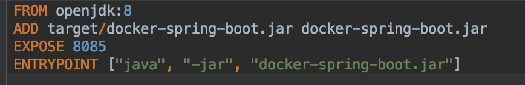
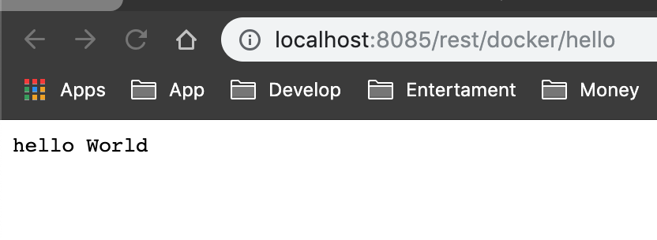

# Docker Spring Boot

## Step

##### 1. Create project at [start.spring.io](start.spring.io) 


##### 2. Create Controller Hello


##### 3. Set finalName in build and Setting port
- set finalName at `pom.xml` <br>


- set port at `resources/application.properties` <br>


##### 4. Create file Dockerfile


##### 5. Install web (pack jar file)
```$ mvn clean install```

##### 6. Check version docker and path project
```
# check version
$ docker -v

# check path
$ pwd
```

##### 7. Build docker
```$ docker build -f Dockerfile -t docker-spring-boot .```


##### 8. Run docker
```$ docker run -p 8085:8085 docker-spring-boot```


##### 9. result
open browser goto `http://localhost:8085`




